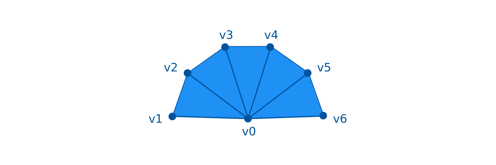

# Procedural Geometry Kit


The procedural geometry kit streamlines the way how meshes can be built.
It provides the several advantages over working directly with Unity's `Mesh` API:

- **Abstraction from low-level mesh representations**: Meshes are represented by different arrays, e.g. an array for the vertex positions, a vertex index array to determine the triangles, an array for normal vectors, etc.
  The procedural geometry kit abstract from this by providing methods for adding vertices or faces. 
  The required low-level operations on the arrays are automatically handeled by the procedural geometry kit.
  This improves the readability of the code since you are working with named methods instead of numberic arrays.
- **Step by step geometry construction**: You can determine the position of vertices and connection between faces in a step-by-step manner, instead of uploading the full vertex and index arrays at once.
- **Multi-threaded, asynchronous geometry construction**: The procedural geometry kit does not use Unity's API in the construction process.
  Therefore, you can calculate the mesh's geometry in a separate thread.
  Only the generation of the final mesh from the specified geometry data has to happen on the main thread.
- **Uses mesh pooling**: Whenever you do not need to use a mesh anymore, you need to make sure that it does not stay in the memory.
  The geometry creator re-uses meshes which are not needed.
- **Support for polygons**: With Unity's native meshes, faces have to be triangles.
  With the procedural geometry kit, you can add polygons with an arbitrary number of vertices to the geometry.
  They are automatically triangulated so that they work with Unity's mesh.

## Usage

### Creating a Geometry Constructor

To create geometry, create a GeometryConstructor object:

```[C#]
GeometryConstructor geometryConstructor = new GeometryConstructor();
```

### Add Vertices

After that, you can add vertices to the geometry using one of the following methods.
The position of the vertex has to be specified.
Optionally, you can also enter the normal vector and UV coordinates.


```[C#]
Vector3 vertexPosition = new Vector3(0, 1, 2);
Vector3 normalVector = new Vector3(1, 1, 1);
Vector2 uvCoordinates = new Vector2(0.5f, 0.5f);
// add a vertex to the geometry
int vertexIndex = geometryConstructor.AddVertex(vertexPosition, uvCoordinates, normalVector);
```

As a result, the index of the vertex is returned.
Use it to construct faces.

### Add Faces

Faces are defined by specifying the vertices that are connected to a face.
In any of the methods that create faces, list the vertices in **clockwise** order.
All the methods also provide an optional last paramter `flipNormals`.
If this argument is set to true, the normal vector of the face will point into the opposite direction, meaning that the face will be visible from hte other side.

In the following code examples `v0, v1, v2...` are integer indices of previously added vertices.

#### Triangles


To add triangles, call the method:
```[C#]
geometryConstructor.AddTriangles(v0, v1, v2);
```

### Quads


To add quads, call the method:
```[C#]
geometryConstructor.AddQuad(v0, v1, v2, v3);
```
The quad is automatically converted to two triangles as shown in the figure.

### Triangle Fan



You can add a triangle fan.
Specify the pole (the vertex which is part of all triangles) first and after that, list the vertices clockwise.

```[C#]
int[] faceIndices = new int[] {v1, v2, v3, v4, v5, v6};
geometryConstructor.AddTriangleFan(v0, faceIndices);
```

### Generate Mesh

After the geometry has been defined, the mesh can be generated:

```[C#]
Mesh result = geometryConstructor.ConstructMesh();
```